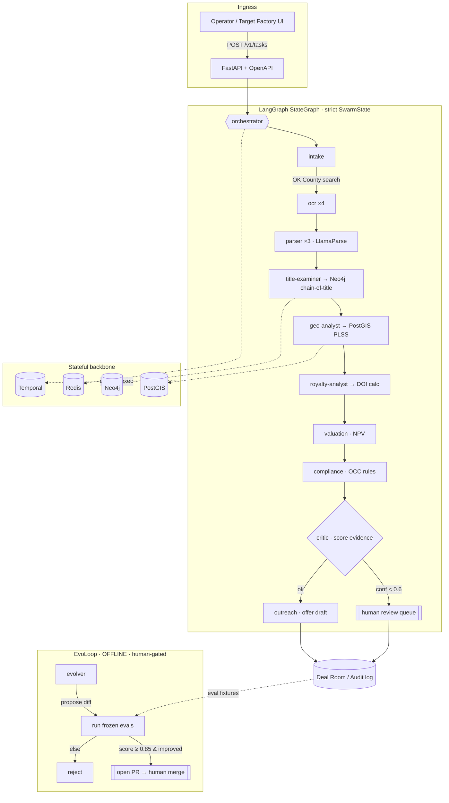

# EvoSwarm v10k Architecture

> Grounded in the **real DataBoss** repo: OK County land-records automation
> (`doto_image_commander`), the multi-LLM OCR/parse backend (`backend/`), and the
> React "Target Factory" deal room (`mineral_deal_room/`). EvoSwarm is the
> orchestration layer over those, not a greenfield fantasy.

## Tree-of-Thought → synthesized hybrid

**Branch 1 — LangGraph core.** One durable `StateGraph` over a strict `SwarmState`.
Pros: typed channels, conditional edges (low-confidence → human review),
checkpointable/replayable for evals. Cons: a single linear graph under-uses
parallelism for fan-out work like OCR.

**Branch 2 — Crew sub-teams.** Role-specialized crews (intake, examination,
valuation, outreach) that self-delegate. Pros: natural parallelism, clean
ownership. Cons: emergent, hard to audit, weak global cost control — a problem
when every OK County image and LLM call costs real money.

**Branch 3 — EvoLoop.** A meta-loop that mutates prompts/specs and keeps what
scores higher. Pros: compounding quality. Cons: unsupervised self-modification of
production code is a liability and a compliance hazard in a regulated
(oil-&-gas / land-title) domain.

**Synthesis (what's built here):** LangGraph is the **durable backbone**;
Crew-style sub-teams are **fan-out nodes inside it** (e.g. `ocr` replicas=4) with a
central `cost_ceiling_usd` per `AgentSpec`; the EvoLoop runs **offline**, gated by
the frozen eval set and a **human-merged PR**. Best of all three, liabilities of
none.

## Mermaid full diagram



## 12 agent YAML specs

All generated + strict-validated from one manifest (`scripts/gen_specs.py`) into
`specs/<name>.agent.yaml`. The full set:

| # | name | role | model | replicas | key tools |
|---|------|------|-------|---------:|-----------|
| 1 | orchestrator | orchestrator | opus-4-8 | 1 | route, spawn |
| 2 | intake | intake | haiku-4-5 | 2 | okcounty_search, pull_list |
| 3 | ocr | ocr | haiku-4-5 | 4 | paddleocr, pdf_split |
| 4 | parser | parser | opus-4-8 | 3 | llamaparse, extract_fields |
| 5 | title-examiner | title_examiner | opus-4-8 | 2 | chain_of_title, neo4j_query |
| 6 | geo-analyst | geo_analyst | haiku-4-5 | 2 | postgis_query, plss_resolve |
| 7 | royalty-analyst | royalty_analyst | opus-4-8 | 2 | doi_royalty_calc |
| 8 | valuation | valuation | opus-4-8 | 1 | comps, npv_model |
| 9 | outreach | outreach | haiku-4-5 | 2 | draft_offer, gmail_draft |
| 10 | compliance | compliance | opus-4-8 | 1 | occ_rules, audit_log |
| 11 | critic | critic | opus-4-8 | 1 | score_evidence, flag_review |
| 12 | evolver | evolver | opus-4-8 | 1 | run_evals, open_pr |

Canonical example (`specs/royalty-analyst.agent.yaml`):

```yaml
name: royalty-analyst
role: royalty_analyst
model: claude-opus-4-8
temperature: 0.0
max_tokens: 8192
tools: [doi_royalty_calc]
system_prompt_ref: prompts/royalty-analyst.md
sub_team: []
replicas: 2
cost_ceiling_usd: '10.00'
```

## Folder structure

```
evoswarm/
├── ARCHITECTURE.md          # this file
├── README.md
├── pyproject.toml           # src layout, pytest pythonpath
├── Dockerfile
├── docker-compose.yml       # PostGIS, Neo4j, Redis, Temporal
├── Tiltfile                 # gen-specs → evals → helm deploy
├── deploy.sh                # one-click (local | k8s)
├── specs/                   # 12 *.agent.yaml (generated, validated)
├── openapi/evoswarm.openapi.yaml   # exported from FastAPI
├── helm/evoswarm/           # 1 chart → API + 12 agent workloads
├── scripts/gen_specs.py     # manifest → specs
├── tests/test_swarm.py      # eval set (also the EvoLoop gate)
└── src/evoswarm/
    ├── schemas.py           # Pydantic v2 STRICT — the contract
    ├── settings.py          # pydantic-settings
    ├── graph.py             # LangGraph orchestrator (+ fallback)
    ├── api.py               # FastAPI surface
    ├── agents/{base,registry}.py
    ├── oklahoma/{ok_county,royalty,postgis}.py
    └── evoloop/loop.py
```

## docker-compose + Tiltfile snippet

```yaml
# docker-compose.yml (excerpt)
services:
  postgres:
    image: postgis/postgis:16-3.4     # PLSS / spacing-unit geometry
    environment: { POSTGRES_USER: evoswarm, POSTGRES_PASSWORD: evoswarm, POSTGRES_DB: evoswarm }
  neo4j:
    image: neo4j:5-community          # chain-of-title graph
  temporal:
    image: temporalio/auto-setup:1.25 # durable agent execution
```

```python
# Tiltfile (excerpt)
local_resource('gen-specs', cmd='python scripts/gen_specs.py',
               deps=['scripts/gen_specs.py', 'src/evoswarm/schemas.py'])
local_resource('evals', cmd='python -m pytest -q',
               deps=['src','tests','specs'], resource_deps=['gen-specs'])
docker_build('evoswarm/api', '.')
k8s_yaml(helm('./helm/evoswarm', name='evoswarm'))
k8s_resource('evoswarm-api', port_forwards=['8080:8080'], resource_deps=['evals'])
```

## One-click deploy script

```bash
./deploy.sh        # local: install → gen-specs → pytest gate → docker compose up
./deploy.sh k8s    # same gate → helm upgrade --install
```

The eval gate runs **before** any deploy in both paths — nothing ships red.

---

## Reflection: "What could cause failure in production?" → patches

1. **Float dollars / royalty rounding disputes.** Paying mineral owners on binary
   floats invites Oklahoma Corporation Commission complaints.
   → *Patched:* `Money` and all royalty math use `Decimal` with explicit
   `ROUND_HALF_UP` and 8-place DOI decimals (`oklahoma/royalty.py`).

2. **Runaway API/LLM spend.** OK County charges per image/search; Opus calls add up.
   → *Patched:* every `AgentSpec` carries `cost_ceiling_usd`; `SwarmState` tracks
   `cost_spent_usd`; the live `OKCountyClient` already estimates+gates before spend,
   and the stub is the default so a cold clone spends $0.

3. **Silent schema drift between agents.** A node emitting an extra/typo'd field
   could corrupt downstream state.
   → *Patched:* `strict=True, extra="forbid"` everywhere; bad payloads fail at the
   edge. (Config-from-YAML coerces at the boundary only — see `agents/base.py`.)

4. **Hallucinated title/royalty conclusions reaching an offer.**
   → *Patched:* `Evidence` requires a `confidence`; the `critic` routes anything
   `< 0.6` to a human review queue instead of `outreach`.

5. **Unsupervised self-modification.** An EvoLoop that hot-patches prod is a
   compliance and safety hazard in a regulated domain.
   → *Patched:* EvoLoop is offline, must beat the frozen eval set by a margin
   (`evoloop_min_eval_score`), and `require_human_pr` forces a human-merged PR.
   Auto-promote is reachable only if an operator explicitly disables the gate.

6. **Cold-clone boot failure** if a heavy dep (langgraph/temporal) is missing.
   → *Patched:* `graph.py` degrades to a sequential runner with identical node
   semantics, so `pytest` and the API come up on a bare clone.

7. **Brittle PLSS string handling.** Free-text legals break geo joins.
   → *Patched:* `PLSSKey` is a regex-constrained type; PostGIS queries are
   parameterized (no SQL string interpolation, ever).
